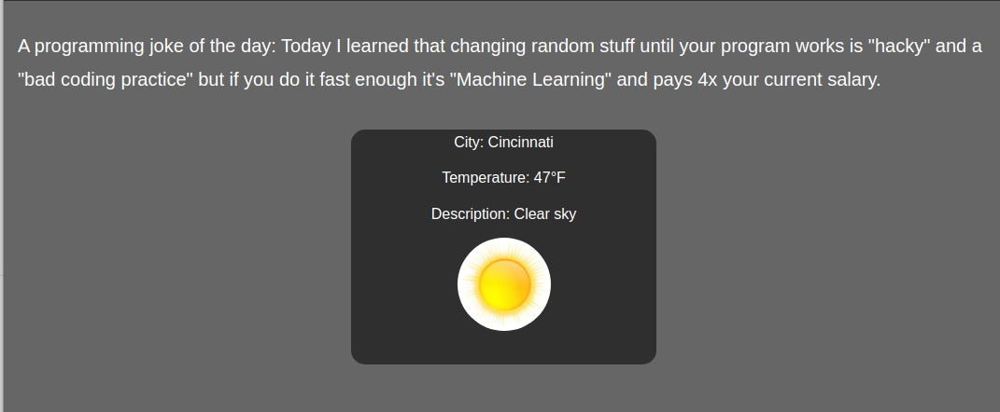

# Instructor: Dr. Phu Phung

# Individual Project 1

# Name: Nick Pham-Rider

## Intro
This project is on creating a professional webpage that includes elements from lab 1 and lab 2.

## Overview
[https://github.com/phamrina/phamrina.github.io](https://github.com/phamrina/phamrina.github.io)

I learned that designing a layout is more difficult than I thought. I made a website like this in the past but I learned a lot more from this project. Integrated cookies and web API's were a bit finicky at first but I eventually got them to work reliably. The thing I spent the most time on was trying to get everything laid out how I wanted. I originally wanted to have two columns with boxes with different heights but I could not figure out how to translate that into code so I went with a more standard layout.

### Hosting

Github hosting is as simple as creating a public repository, selecting which branch to be the directory for the website, and making a index.html file.

### Link

The link is made by  `<a href="*link to the html page*">Click Here</a>`

### Page Tracker

The provider of the flag counter provided a reference link and all of the code. I just put it in its own div.

### jQuery

I tweaked the code a bit from lab 2 and then made it fit within the layout of the page using media objects and bodys and footers.

### Web APIs

The jokeAPI was plug and play other than an a setInterval function that updates every minute. The weatherAPI was a bit tricky as I had no other experience working with APIs. I had to do some of my own research on how to implement it but I figured it out. For the graphics, I set up a search through the weather description for key words that call an related img when found.

### Cookies

I separated the cookies function into three parts: Setting the Date on the Cookie, Getting the cookie of the visitor by name, and checking if that visitor is new or returning.